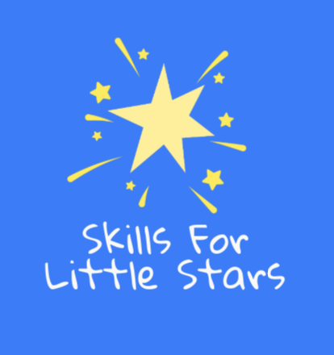

<!-- PROJECT LOGO -->
 

    

<!-- TABLE OF CONTENTS -->

  
Table of Contents

  <ol>
    <li><a href="#about-the-project">About The Project</a>
    <li><a href="#features">Features</a></li>
    <li><a href="#built-with">Built With</a></li>
    <li><a href="#installation-and-setup">Installation & Setup</a></li>
    <li><a href="#contributing">Contributing</a></li>
    <li><a href="#icebox-items">Ice Box Items</a></li>
    <li><a href="#contact">Contact</a></li>
  </ol>

<!-- CONTENT -->

## About the Project

Welcome to Skills for Little Stars! 🎉 This interactive and fun educational platform is designed for young learners aged 3-5 years old. Our app helps kids develop essential skills through engaging activities, quizzes, and interactive lessons.

## Features

- Learn 📚: Explore subjects like Math, Listen and Read, Shapes and Colors, and Space.

- Practice ✏️: Reinforce learning with interactive exercises - coming soon.

- Quiz 🧠: Test knowledge and track progress - coming soon.

- Progress Tracking 📊: Monitor learning achievements.

- Parents Section 👨‍👩‍👧: View insights into your child's learning journey.

## Built With

- Frontend: [React](https://reactjs.org/)

- State Management: [Redux](https://redux.js.org/)

- Backend: [Flask](https://flask.palletsprojects.com/en/stable/), [SQLAlchemy](https://docs.sqlalchemy.org/en/20/)

- Database: [PostgreSQL](https://www.postgresql.org/docs/)

- Styling: CSS

## Installation and Setup

#### Prerequisites

Ensure you have the following installed:

- Node.js & npm

- Python & pip

- PostgreSQL

#### Steps to Run Locally
1. Clone the repository:
> https://github.com/Rrantisi/Skills-for-Little-Stars.git

> cd Skills-for-Little-Stars

3. Install frontend dependencies:
> cd frontend

> npm install

4. Install backend dependencies:
> cd ../backend

> pip install -r requirements.txt

5. Set up the database:
> flask db upgrade

6. Start the backend server:
> flask run

7. Start the frontend server:
> cd ../frontend

> npm start

## Contributing

Contributions are welcome! Feel free to fork the repository, make your changes, and submit a pull request.

## Icebox Items

- Implement an interactive way to display quiz content.

- Develop an engaging, interactive way to present practice content.

- Add settings functionality for parents page to change username, update password, and set progress notifications.

## Contact

 Reham Rantisi - rantisireham19@gmail.com

 

[:arrow_up: Back to top](#SkillsForLittleStars)
